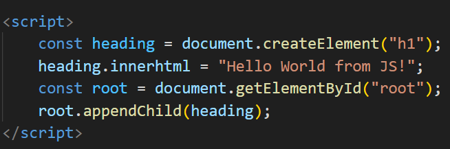
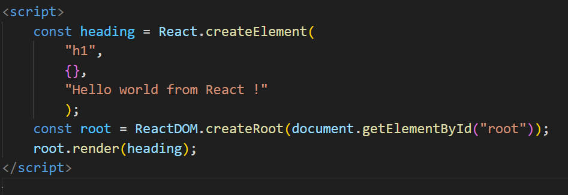

# Episode 1 - Inception

## -> In this episode we first learn about Emmet, i.e basically skelaton code generator inside VS code.

## -> Then after we create a simple hello world program using plane HTML tags.

## -> We then connect java-script to our html code and inject h1 heading from that, into the webpage

#### 

## -> We then proceed to add react to our project by adding 2 cdn links in out html file and <u>these links should come before we start writing our react code.</u>

Note 1 - React will overwrite everything inside "root" and replaces with whatever comes inside render.

Note 2 - The {} inside createElement is called as props and will be passed as attributes to the tag that I am creating. Ex. {id="hello"} this will assign id as hello to the h1 tag.

 ------------------XXX-----------------------